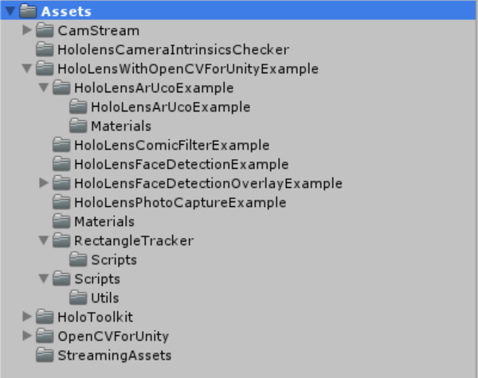
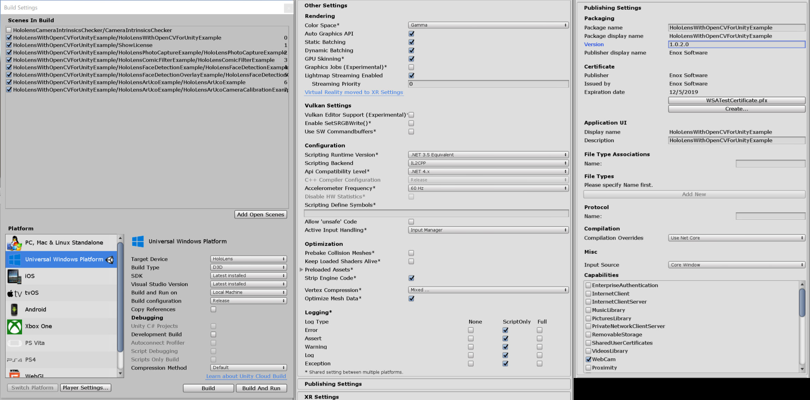

HoloLens With OpenCVForUnity Example
====================

What's new
-----
By using the ÅgHoloLensCameraStreamÅh asset, video capture can now be executed faster.

Demo Video (old version)
-----

Environment
-----
Windows 10 Pro 1709  
Windows 10 SDK 10.0.14393.0 to 10.0.16299.0
Visual Studio 2017 (v151.5.0)
Unity 2017.1.3f1  
HoloToolkit-Unity-v1.2017.1.2 ([https://github.com/Microsoft/MixedRealityToolkit-Unity/releases](https://github.com/Microsoft/MixedRealityToolkit-Unity/releases))  
OpenCV for Unity 2.2.6 ([https://assetstore.unity.com/packages/tools/integration/opencv-for-unity-21088](https://assetstore.unity.com/packages/tools/integration/opencv-for-unity-21088))  
HoloLensCameraStream ([https://github.com/VulcanTechnologies/HoloLensCameraStream](https://github.com/VulcanTechnologies/HoloLensCameraStream))  

Setup
-----
* Clone this repository.
* Create a new project. (HoloLensWithOpenCVForUnityExample)
* Import the HoloToolkit-Unity-v1.2017.1.2.unitypackage.
* Setup the HoloToolKit. (Mixed Reality ToolKit > Configure > Apply Mixed Reality Project Setting)
* Import the OpenCVForUnity.
* Clone HoloLensCameraStream repository.
* Import the HoloLensCameraStream. (Copy the ÅgHoloLensCameraStream/HoloLensVideoCaptureExample/Assets/CamStream/Åh folder to the ÅgAssets/Åh folder.)
* Import the HoloLensWithOpenCVForUnityExample.unitypackage.
 
* Add the ÅgAssets/HoloLensWithOpenCVForUnityExample/*.unityÅh files to the ÅgScenes In BuildÅh list in the ÅgBuild SettingsÅh window.
* Add the ÅgWebCamÅh to ÅgPublishing Settings > CapabilitiesÅh checklist in the ÅgPlayer SettingsÅh window.
 
* Build and Deploy to HoloLens. (See [https://developer.microsoft.com/en-us/windows/holographic/holograms_100](https://developer.microsoft.com/en-us/windows/holographic/holograms_100))
*  (Print the AR marker ÅgArUcoMarker_DICT_6X6_250_ID1.pdfÅh on an A4 size paper)

ScreenShot (old version)
-----
 

 

 

 

 

