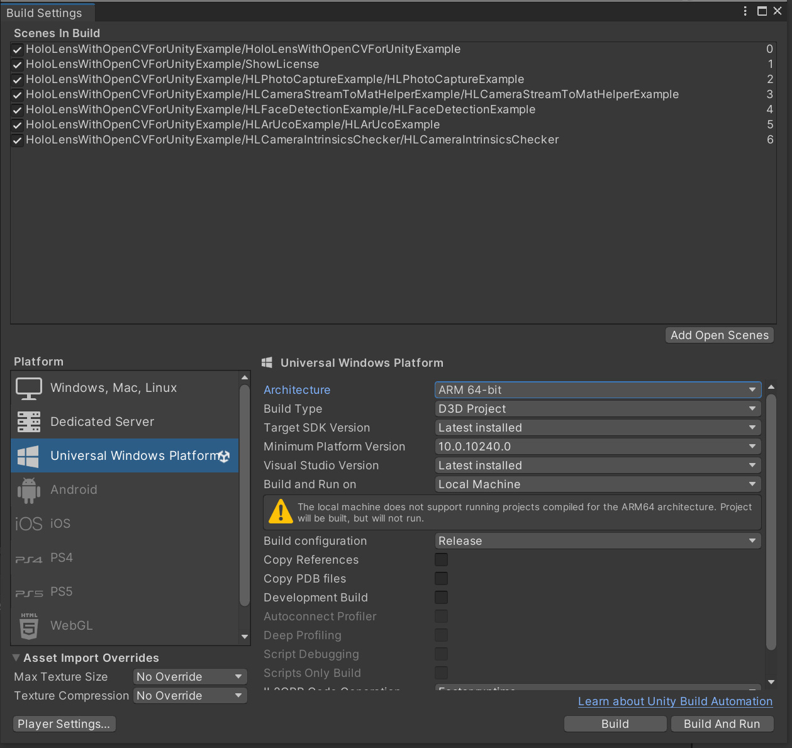

# HoloLens With OpenCVForUnity Example

## Demo Video (old version)

## Environment
* HoloLens1 10.0.17763.316 / HoloLens2 22621.1399
* Windows 10 SDK 10.0.19041.0 / 10.0.22621.0
* Unity 2021.3.35f1 (Built-in Render Pipeline / OpenXR 1.11.1 / MRTK 2.8.3 / DirectX 11 / Visual Studio 2022 MSVC v143)
* Unity 2021.3.35f1 (Built-in Render Pipeline / OpenXR 1.11.1 / MRTK 3.2.2 / DirectX 11 / Visual Studio 2022 MSVC v143)
* [Mixed Reality Feature Tool](https://learn.microsoft.com/en-us/windows/mixed-reality/develop/unity/welcome-to-mr-feature-tool)
* [OpenCV for Unity](https://assetstore.unity.com/packages/tools/integration/opencv-for-unity-21088?aid=1011l4ehR) 2.6.4+ 
* [EnoxSoftware/HoloLensCameraStream](https://github.com/EnoxSoftware/HoloLensCameraStream)

## Setup (Common)
1. Download the latest release unitypackage. [HoloLensWithOpenCVForUnityExample.unitypackage](https://github.com/EnoxSoftware/HoloLensWithOpenCVForUnityExample/releases)
1. Create a new project. (`HoloLensWithOpenCVForUnityExample`)
    * Change the platform to `UWP` in the "Build Settings" window.
1. Import and setup the Microsoft Mixed Reality Toolkit. (Recommend using [MixedRealityFeatureTool](https://www.microsoft.com/en-us/download/details.aspx?id=102778))
1. Import the OpenCVForUnity.
    * Select MenuItem[Tools/OpenCV for Unity/Open Setup Tools].
    * Click the [Move StreamingAssets Folder] button.
    * Leave the following files and delete the rest. ("StreamingAssets/OpenCVForUnity/objdetect/haarcascade_frontalface_alt.xml", "lbpcascade_ frontalface.xml")
1. Clone HoloLensCameraStream repository.
    * Copy the "HoloLensCameraStream/HoloLensVideoCaptureExample/Assets/CamStream/" folder to the "Assets/" folder.
1. Import the HoloLensWithOpenCVForUnityExample.unitypackage.
1. Add the "Assets/HoloLensWithOpenCVForUnityExample/*.unity" files to the "Scenes In Build" list in the "Build Settings" window.
1. Configure settings in the "Project Settings" window.
    * Add Define Symbols: the following to `Scripting Define Symbols` depending on the XR system used in your project; Legacy built-in XR: `BUILTIN_XR`; XR Plugin Management (Windows Mixed Reality): `XR_PLUGIN_WINDOWSMR`; XR Plugin Management (OpenXR):`XR_PLUGIN_OPENXR`.
    * Enable `WebCam` Capabilties in Publishing settings tab.
1. (Optional) Setup a performance environment suitable for Holorens. (See [https://docs.microsoft.com/en-us/windows/mixed-reality/develop/unity/recommended-settings-for-unity](https://docs.microsoft.com/en-us/windows/mixed-reality/develop/unity/recommended-settings-for-unity))
1. **Build the project:** You can now build the Unity project, which generates a Visual Studio Solution (which you will then have to also build). With the Build Settings window still open, click **Build**. In the explorer window that appears, make a new folder called `App`, which should live as a sibling next to the 'Assets` folder. Then click Select Folder to generate the VS solution in that folder. Then wait for Unity to build the solution.
1. **Open the VS Solution:** When the solution is built, a Windows explorer folder will open. Open the newly-built VS solution, which lives in `App/HoloLensWithOpenCVForUnityExample.sln`. This is the solution that ultimately gets deployed to your HoloLens.
1. **Configure the deploy settings:** In the Visual Studio toolbar, change the solution platform from `ARM` to `x86` if you are building for Hololens1 or to `ARM64` if you are building for Hololens2; Change the deploy target (the green play button) to `Device` (if your HoloLens is plugged into your computer), or `Remote Machine` (if your HoloLens is connected via WiFi).
1. **Run the app:** Go to **Debug > Start Debugging**. Once the app is deployed to the HoloLens, you should see some confirmation output in the Output window.
    *  (Print the AR marker "CanonicalMarker-d10-i1-sp500-bb1.pdf" on an A4 size paper)  

* [Choosing a Unity version and XR plugin](https://learn.microsoft.com/en-us/windows/mixed-reality/develop/unity/choosing-unity-version)
* [Known issues in Unity versions and packages](https://learn.microsoft.com/en-us/windows/mixed-reality/develop/unity/known-issues)

## Setup (Unity 2021 (Built-in Render Pipeline / OpenXR / MRTK 2 / DirectX 11 / Visual Studio 2022))
1. Download the latest release unitypackage.
1. Create a new project. (`HoloLensWithOpenCVForUnityExample`)
1. Import the Microsoft Mixed Reality Toolkit.
    * Add MRTK2 (Mixed Reality Toolkit - Mixed Reality Toolkit Foundation) and OpenXR(Platform Support - Mixed Reality OpenXR Plugin) to the project using "Mixed Reality Feature Tool".
    * Follow the MRTK2 configuration dialog to set up the project. (XR System: OpenXR)
1. Import the OpenCVForUnity.
1. Import the HoloLensCameraStream.
1. Import the HoloLensWithOpenCVForUnityExampleMRTK2.unitypackage.
1. Add the "Assets/HoloLensWithOpenCVForUnityExample/*.unity" files to the "Scenes In Build" list in the "Build Settings" window.
1. Configure settings in the "Project Settings" window.
    * Add `XR_PLUGIN_OPENXR` to the list of Define Symbols.
    * Enable `WebCam` Capabilties in Publishing settings tab.
1. Build the project; open it in VS2022, set the deployment target to `ARM64` and deploy it to the Hololens2 actual device.

* [Set up a new OpenXR project with MRTK](https://learn.microsoft.com/en-us/windows/mixed-reality/develop/unity/new-openxr-project-with-mrtk)

## Setup (Unity 2021 (Built-in Render Pipeline / OpenXR / MRTK 3 / DirectX 11 / Visual Studio 2022))
1. Download the latest release unitypackage.
1. Create a new project. (`HoloLensWithOpenCVForUnityExample`)
1. Import the Microsoft Mixed Reality Toolkit.
    * Add MRTK3 (MRTK3 - MRTK Input, MRTK UX Components, MRTK UX Components (Non-Canvas)) and OpenXR(Platform Support - Mixed Reality OpenXR Plugin) to the project using "Mixed Reality Feature Tool".
    * * Set up the MRTK3. (XR System: OpenXR)
1. Import the OpenCVForUnity.
1. Import the HoloLensCameraStream.
1. Import the HoloLensWithOpenCVForUnityExampleMRTK3.unitypackage.
1. Add the "Assets/HoloLensWithOpenCVForUnityExample/*.unity" files to the "Scenes In Build" list in the "Build Settings" window.
1. Configure settings in the "Project Settings" window.
    * Add `XR_PLUGIN_OPENXR` to the list of Define Symbols.
    * Enable `WebCam` Capabilties in Publishing settings tab.
1. Build the project; open it in VS2022, set the deployment target to `ARM64` and deploy it to the Hololens2 actual device.

* [Setting up a new Unity project with MRTK3](https://learn.microsoft.com/en-us/windows/mixed-reality/mrtk-unity/mrtk3-overview/getting-started/setting-up/setup-new-project)

|Project Assets|Build Settings|
|---|---|
|||

|Player Settings|
|---|
||

## ScreenShot (old version)
 

 

 

 

 

