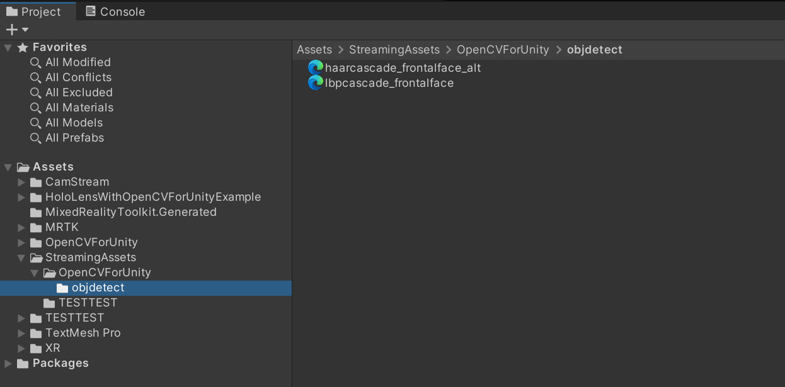
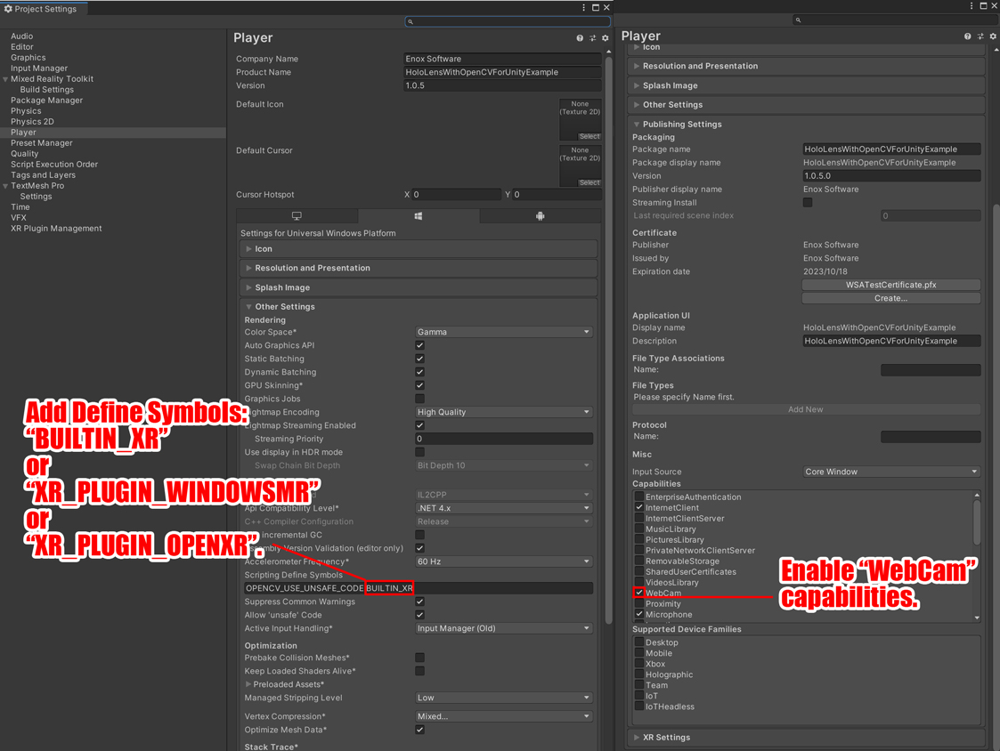

# HoloLens With OpenCVForUnity Example

## What's new
* Changed the HoloLensCameraStream plugin to the camnewnham's repository. (Improve camera update FPS, hide recording icon, extract camera intrinsic)

## Demo Video (old version)

## Demo Hololens App
* [HoloLensWithOpenCVForUnityExample.zip](https://github.com/EnoxSoftware/HoloLensWithOpenCVForUnityExample/releases)
* Use the Windows Device Portal to install apps on HoloLens. [https://docs.microsoft.com/en-us/hololens/hololens-install-apps](https://docs.microsoft.com/en-us/hololens/hololens-install-apps)

## Environment
* Hololens 10.0.17763.914 (RS5)
* Windows 10 SDK 10.0.18362.0
* Visual Studio 2017 or 2019
* Unity 2018.4.28f1+  
* [Microsoft Mixed Reality Toolkit](https://github.com/Microsoft/MixedRealityToolkit-Unity/releases) v2.2.0 
* [OpenCV for Unity](https://assetstore.unity.com/packages/tools/integration/opencv-for-unity-21088?aid=1011l4ehR) 2.4.1+ 
* [camnewnham/HoloLensCameraStream](https://github.com/camnewnham/HoloLensCameraStream) 

## Setup
1. Download the latest release unitypackage. [HoloLensWithOpenCVForUnityExample.unitypackage](https://github.com/EnoxSoftware/HoloLensWithOpenCVForUnityExample/releases)
1. Create a new project. (HoloLensWithOpenCVForUnityExample)
1. Import the OpenCVForUnity.
    * Setup the OpenCVForUnity. (Tools > OpenCV for Unity > Set Plugin Import Settings)
    * Move the "OpenCVForUnity/StreamingAssets/haarcascade_frontalface_alt.xml" and "OpenCVForUnity/StreamingAssets/lbpcascade_frontalface.xml" to the "Assets/StreamingAssets/" folder.
1. Clone HoloLensCameraStream repository.
    * Copy the "HoloLensCameraStream/HoloLensVideoCaptureExample/Assets/CamStream/" folder to the "Assets/" folder.
    * Set the scripting backend of the plugin inspector to "Any Script Backend". (IL2CPP support)
1. Import the Microsoft.MixedReality.Toolkit.Unity.Foundation.2.2.0.unitypackage.
    * Setup the MRTKv2. (Mixed Reality ToolKit > Utilities > Configure Unity Project)
1. Import the HoloLensWithOpenCVForUnityExample.unitypackage.
1. Add the "Assets/HoloLensWithOpenCVForUnityExample/*.unity" files to the "Scenes In Build" list in the "Build Settings" window.
1. Setup a performance environment suitable for Holorens. (See [https://docs.microsoft.com/en-us/windows/mixed-reality/develop/unity/recommended-settings-for-unity](https://docs.microsoft.com/en-us/windows/mixed-reality/develop/unity/recommended-settings-for-unity))
1. Build and Deploy to HoloLens. (See [https://developer.microsoft.com/en-us/windows/holographic/holograms_100](https://developer.microsoft.com/en-us/windows/holographic/holograms_100))
    *  (Print the AR marker "CanonicalMarker-d10-i1-sp500-bb1.pdf" and "ChArUcoBoard-mx5-my7-d10-os1000-bb1.pdf" on an A4 size paper)  

|Project Assets|MRTK Project Configurator|
|---|---|
|||

|Build Settings|Player Settings|
|---|---|
|||

## ScreenShot (old version)
 

 

 

 

 

